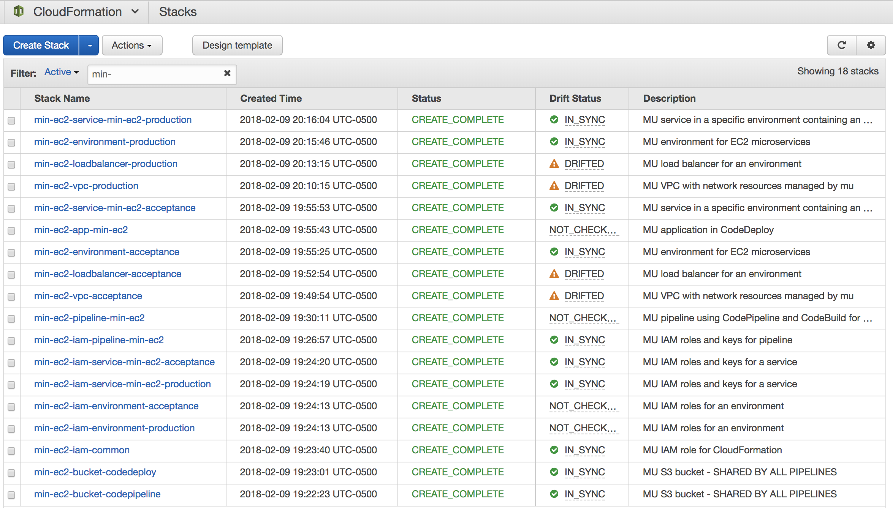
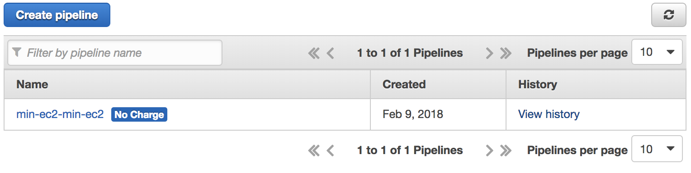

 

# mu-minimal-ec2
This is a sample [`mu`](https://github.com/stelligent/mu) project using ec2 providers and NO custom CFN.

If you are unfamiliar with [`mu`](https://github.com/stelligent/mu),
you will want to [start here](http://getmu.io/)

This is a sample project showing how to deploy a standalone
webapp to EC2 using [`mu`](https://github.com/stelligent/mu).  The web app in this case is
the smallest possible Flask application.  

# Technologies used

  * Stelligent [`mu`](https://github.com/stelligent/mu) 
  * Amazon Web Services
    * AWS Cloudformation
    * AWS CodePipeline
    * AWS CodeBuild
    * AWS CodeDeploy
    * AWS Elastic LoadBalancers, VPC, Subnets
  * [Upstart](http://upstart.ubuntu.com/cookbook/#standard-environment-variables), which is manages services on Amazon Linux & other CentOS 6.x-based systems.

# Prerequisites
  * An AWS Account
  * a Github Account
  * a Github Token - [create one here](https://github.com/settings/tokens)
  * Stelligent [`mu`](https://github.com/stelligent/mu) 
  * AWS Access keys set up in $HOME/.aws 

# Instructions
  * Fork this repository in github.
  * Clone your forked repository: 

    `git clone git@github.com:<your-github-name>/mu-minimal-ec2.git`

  * `cd` to the newly cloned directory
  * Change the `keyName` property inside `mu.yml` to match a keypair from your own EC2 dashboard.
  * Add, commit, and push the changed `mu.yml` to your repository.
  * `mu pipeline up -t <your-github-token>`

    This command creates an entire CodePipeline project, with the following stages:
    * Source - a docker container starts, and get a copy of your source code from GitHub or AWS CodeCommit.
    * Build - your software is built, tested, packaged according to instructions in your repo's buildspec.yml file. This uses AWS CodeBuild.
    * Deploy to Acceptance - a new environment called "acceptance" is created (or updated) with your software.  This uses AWS CodeDeploy.
    * Deploy to Production - after the one-and-only manual step, which is to offer Red and Green buttons to stop the pipeline, or deploy the software that is in Acceptance to the last environment, which is Production. This also uses AWS CodeDeploy.

    These stages are executed in order, with any error or test failure stopping the pipeline.

    Automating these steps is a fundamental concept in Continuous Delivery (CI) and Continuous Integration. 

  * (optional) Navigate to the CloudFormation console, and watch the stacks form.  They'll look something like this:

 <a style='margin-left: 4em;' href="./blog-images/min-ec2-stacks.png">
 </img>
 </a>

* (optional) Once the stacks are complete, you can watch the CodePipeline execute.

 <a style='margin-left: 4em;' href="./blog-images/pipeline-list.png">
 </img>
 </a>

 * (optional) Clicking on the pipeline above will show you the stages of the pipeline.

 <a style='margin-left: 4em;' href="./blog-images/pipeline-detail.png">
 </img>
 </a>

 * (optional) You can also drill down into each of the stages to find even more detail about how the pipeline works.

In particular, the **Deploy stages of the pipeline actually creates updates the Infrastructure**.  This is another core concept in DevOps known as [infrastructure-as-code](https://stelligent.com/2017/06/29/devops-benefits-of-infrastructure-as-code/), and is fully implemented by `mu pipeline`.  The infrastructure in this example includes:
  * networking: VPC, subnets, security groups
  * compute: EC2 instances (alternatively, ECS and Fargate are also supported in [`mu`](https://github.com/stelligent/mu))
  * storage: S3 buckets supporting the build artifacts
  * resiliency: AutoScaling groups and the Elastic Load Balancer definitions come with [`mu`](https://github.com/stelligent/mu) by default.

This means that if you want to change your infrastructure (AutoScaling parameters, your EC2 or RDS instance sizes, etc), you can implement those changes the same way you do your code changes:  Change a file, run `git add`, `git commit`, and `git push`!  

# Walkthrough of the files 

## `mu.yml`

Naturally, this example of [`mu`](https://github.com/stelligent/mu) usage starts with a [`mu.yml`](https://github.com/timbaileyjones/mu-minimal-ec2/blob/master/mu.yml).
There are two sections: one for `environments`, and one for `service`s.

The `environments:` section from lines 2 to 6, are a simple list of the environment `name`s you wish to have (acceptance, staging, sandbox, demo, production, whatever).  The `provider` value can have one of three different values (`ec2`, `ecs`, and `fargate`).  

In this section, you can specify many other things about your environments.  
 * You can define `cluster`s, with minimum and maximum sizes, discover protocols such as `consul`, 
 * If you give it a `keyName` parameter (a keypair name), [`mu`](https://github.com/stelligent/mu)  will automatically provision a bastion host, and NOT assign a public IP address to your EC2 instances.
 * You also tell [`mu`](https://github.com/stelligent/mu)  to place its resources in particular VPCs.

The `services:` section is from line 8 to 17, and specifies just the bare necessities.  We're going to accept incoming connections on port 80, route them to our application on port 8080, checking the / endpoint for `200 OK` responses, and use the code in the `repo` specified on line 17.

This repository demonstrates the basics, but `services` can also have:
  * Pipelines, building from AWS Code Commit or Github.
  * environment variable sets: 
  * RDS databases
  * Health check parameters.
  * Elastic Load Balancers, http, https or both.
  * ELB listener rules, with condition matches by `host-header` and `path-pattern`.
  * ELBs can also work with AWS Route53 Hosted Zones (so that AWS updates your DNS records too)
  * and a growing ecosystem of [`mu`](https://github.com/stelligent/mu) [extensions](https://github.com/stelligent/mu-extension-example).

## `buildspec.yml`

[`mu`](https://github.com/stelligent/mu)  uses AWS CodePipeline, CodeBuild, and CodeDeploy to turn your github repo into a deployed service.  The [buildspec.yml](https://github.com/timbaileyjones/mu-minimal-ec2/blob/master/buildspec.yml) contains instructions (lines 3-6), on how to install prerequisites, how to invoke the build, do any postprocessing (minification, compression, archiving, etc).  

Finally, you specify what files are to be deployed via the `artifacts/files:` section from line 8 to 10.

You can (and should) also use buildspec.yml to run unit tests.  Make sure all your commands return non-zero if there are any failures.

## `hello.py`

[`mu`](https://github.com/stelligent/mu) works best when you have a service to deploy. In this example repo, we have included the smallest possible [Flask](http://flask.pocoo.org/) application possible, predictably named [hello.py](https://github.com/timbaileyjones/mu-minimal-ec2/blob/master/hello.py).  It listens on a port number, and responds to incomgin `GET /` requests with a hardcoded string.  You could easily replace this with a Node/Express app, or any other framework that includes it's own webserver.  I chose Flask for this example because it requires only one tiny file, and doesn't get in the way of showcasing [`mu`](https://github.com/stelligent/mu)!

So, now we just needs to tell the system how to install it, start it, and stop this service.

## appspec.yml 

The [`appspec.yml`](https://github.com/timbaileyjones/mu-minimal-ec2/blob/master/appspec.yml)  file contains the commands that install, start and stop the service.  
 * The `files` section tells the system  which files to move, and where they should reside.
 * There are `hooks` section, with hooks called `BeforeInstall` (line 8), `ApplicationStop` (line 11), and `ApplicationStart` (line 14).  Each hook has a script location and a timeout in seconds.  These scripts reside in a `codedeploy` directory, primarily to keep the root directory a little cleaner.

## ./codedeploy directory

 * [`codedeploy/install_service.sh`](https://github.com/timbaileyjones/mu-minimal-ec2/blob/master/codedeploy/install_server.sh) is straightforward.  It installs just three things: 
   * the flask libraries from Python's `pip` packaging system.
   * the source code from the CodeDeploy agent.
   * the Upstart script for the service at /etc/init/mu-minimal-ec2.conf
 * [`codedeploy/start_server.sh`](https://github.com/timbaileyjones/mu-minimal-ec2/blob/master/codedeploy/start_server.sh) tells `upstart` to start the service
 * [`codedeploy/stop_server.sh`](https://github.com/timbaileyjones/mu-minimal-ec2/blob/master/codedeploy/stop_server.sh) is also easy.  It tells `upstart` to stop the service.

# Use your new application

Use `mu env show acceptance` to display key information about your app.  One of the attributes is the ELB endpoint.  

 <a style='margin-left: 4em;' href="./blog-images/min-ec2-stacks.png">
 </img>
 </a>

# Conclusion
This repository demonstrates using [`mu`](https://github.com/stelligent/mu) to deploy software to EC2.  You should also know that this is just one of several deployment models that [`mu`](https://github.com/stelligent/mu)  supports.  [`mu`](https://github.com/stelligent/mu) can also dockerize your application and deploy it to [AWS Elastic Container Service (Amazon ECS)](https://aws.amazon.com/ecs/) and [AWS Fargate](https://aws.amazon.com/fargate/). For the latest developments in [`mu`](https://github.com/stelligent/mu), you can star the mu repository.

Stelligent engineers also staff a live chat/support forum at [gitter.im/stelligent/mu](https://gitter.im/stelligent/mu).  You can also read through the [mu wiki](https://github.com/stelligent/mu/wiki) or file an [issue](https://github.com/stelligent/mu/issues).
